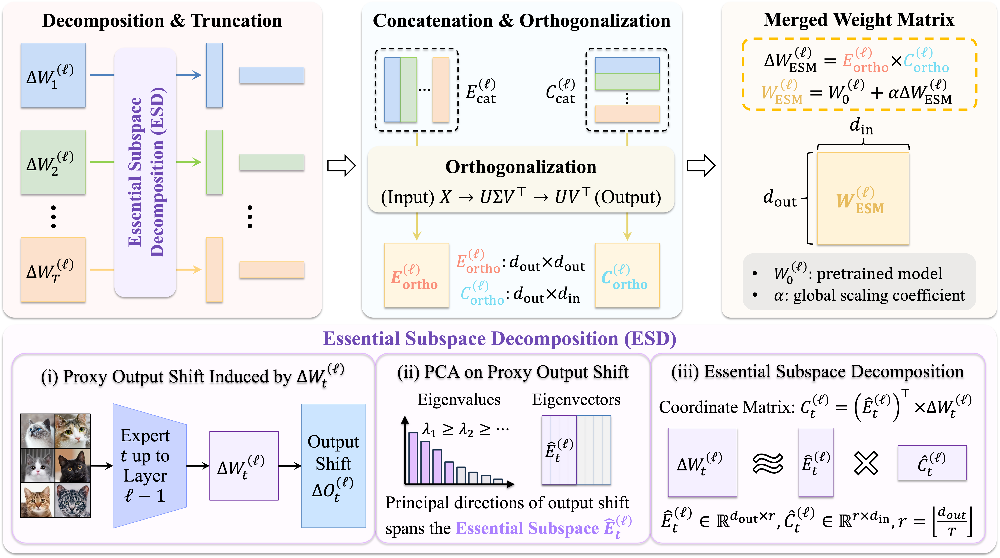
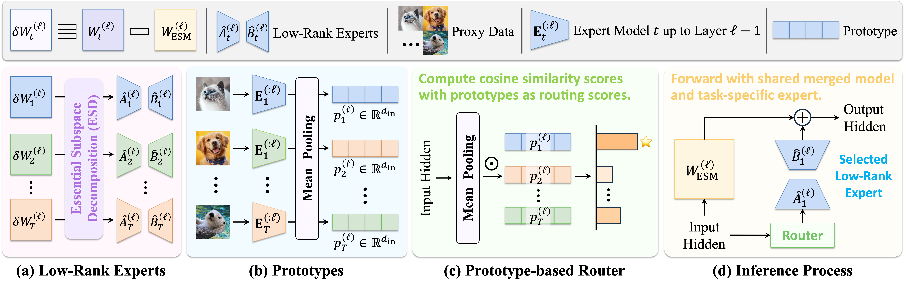
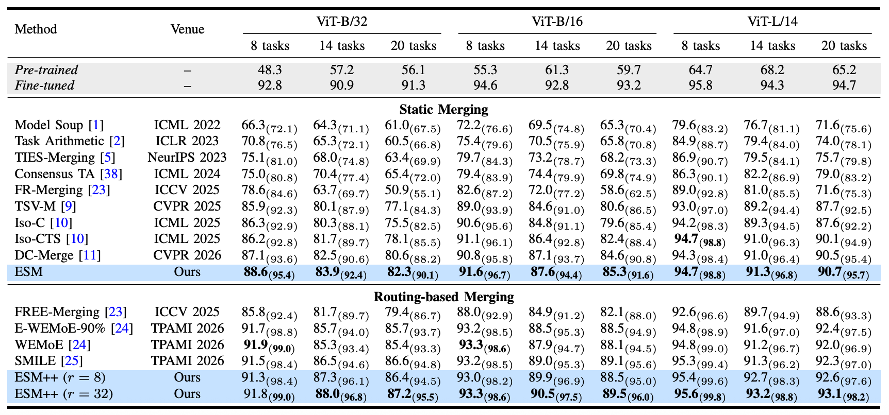
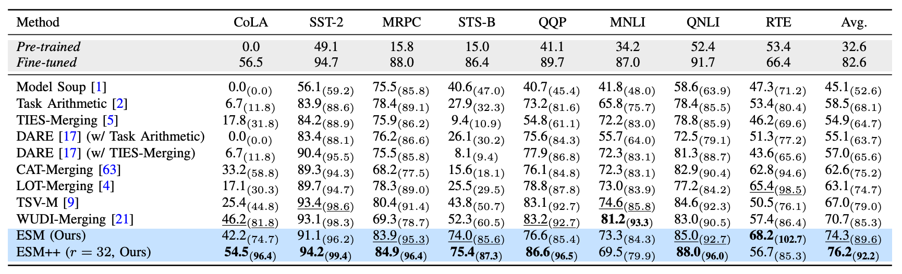

# Essential Subspace Merging for Training-Free Multi-Task Learning

[ESM-ViT](ESM-ViT/) | [ESM-RoBERTa](ESM-RoBERTa/)

**ESM** (Essential Subspace Merging) and **ESM++** (Essential Subspace Routing) are two training-free methods for merging multiple task-specific models into a single unified model. They require only a handful of unlabeled proxy samples (≤32 per task) — no retraining, no gradient-based optimization.

- **ESM** — static merge: compresses all experts into **one compact model** with single-model inference cost.

- **ESM++** — dynamic routing: builds a lightweight **mixture of experts** on top of the ESM base, routing each input to the best expert via cosine similarity with pre-computed prototypes.



## Core Idea: Essential Subspace Decomposition (ESD)

Both methods are built on **ESD**, which decomposes task-specific weight updates into data-driven principal directions:

1. **Compute output shift**: pass proxy inputs through each expert, collect output activation differences between the expert and the pretrained model.
2. **PCA**: perform PCA on the stacked output shifts to obtain eigenvectors $E$ (ordered by eigenvalue).
3. **Low-rank projection**: project each task matrix $\Delta W$ onto the top-$r$ principal directions:
   $$
   \Delta W \approx \hat{E} \hat{C}, \quad \hat{C} = \hat{E}^\top \Delta W
   $$
   The truncation error depends only on discarded eigenvalues — tighter than SVD.

---

## ESM (Static Merging)

Fuse $T$ experts into **one model**. Inference cost = single model.

**Per layer:**

1. **ESD** each task's $\Delta W_t$ → $(\hat{E}_t, \hat{C}_t)$ with rank $r = \lfloor d_{\text{out}} / T \rfloor$.
2. **Concatenate**: $E_{\text{cat}} = [\hat{E}_1 \mid \dots \mid \hat{E}_T]$,  $C_{\text{cat}} = [\hat{C}_1; \dots; \hat{C}_T]$.
3. **Orthogonalize** via weighted polar decomposition (SVD-based) to remove inter-task interference.
4. **Reconstruct**: $\Delta W_{\text{ESM}} = E_{\text{ortho}} C_{\text{ortho}}$, then $W_{\text{ESM}} = W_0 + \alpha \cdot \Delta W_{\text{ESM}}$.

The global scaling $\alpha$ is determined by ternary search on a small validation set.

---

## ESM++ (Dynamic Routing)

Builds on the ESM base by adding per-task low-rank residual experts.

**Setup (offline):**

1. Compute residual $\delta W_t = W_t - W_{\text{ESM}}$.
2. Apply ESD to $\delta W_t$ with a small rank $r$ (e.g., 8 or 32) → factors $(\hat{B}_t, \hat{A}_t)$.
3. Collect **prototypes** $p_t^{(\ell)}$: mean-pooled layer inputs from proxy data.

**Inference (per layer):**

1. Mean-pool current layer input → $\bar{x}$.
2. Compute cosine similarity $s_t = \cos(\bar{x}, p_t)$ for all tasks.
3. Select best expert: $t^* = \arg\max s_t$.
4. Route: $W^{(\ell)} = W_{\text{ESM}}^{(\ell)} + \hat{B}_{t^*}^{(\ell)} \hat{A}_{t^*}^{(\ell)}$.

No auxiliary router network — routing is **parameter-free** and uses only pre-computed prototypes.

---


## Results


### Visual Recognition (CLIP-ViT, 8–20 tasks)



### GLUE Benchmark (RoBERTa-base, 8 tasks)




---

## Project Structure

```
ESM/
├── README.md
├── ESM-RoBERTa/           # NLP: RoBERTa on GLUE
│   ├── run_merge.py        # Main entry point
│   ├── merge.py            # ESM + ESM++ core algorithms
│   ├── esm_moe_eval.py     # ESM++ routing evaluator
│   ├── essential_subspace_decomposition.py
│   ├── search_scaling.py   # Alpha search for ESM
│   ├── prepare_validation.py
│   └── ...
└── ESM-ViT/               # Vision: ViT on visual benchmarks
    ├── esm.py / esmpp.py
    ├── essential_subspace_decomposition.py
    └── src/
```


## License

This project is released under the MIT License. See [LICENSE](ESM-ViT/LICENSE) for details.
