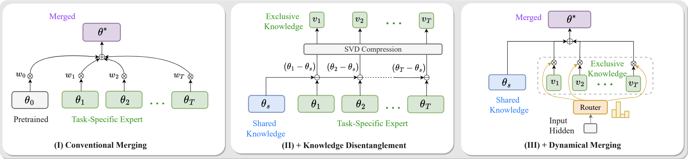

# ESM & ESM++: Essential Subspace Mixture for Training-Free Multi-Task Model Merging

[ESM-RoBERTa](ESM-RoBERTa/) | [ESM-ViT](ESM-ViT/)

**ESM** (Essential Subspace Merging) and **ESM++** (Essential Subspace Routing) are two training-free methods for merging multiple task-specific models into a single unified model. They require only a handful of unlabeled proxy samples (≤32 per task) — no retraining, no gradient-based optimization.

- **ESM** — static merge: compresses all experts into **one compact model** with single-model inference cost.
- **ESM++** — dynamic routing: builds a lightweight **mixture of experts** on top of the ESM base, routing each input to the best expert via cosine similarity with pre-computed prototypes.



---

## Core Idea: Essential Subspace Decomposition (ESD)

Both methods are built on **ESD**, which decomposes task-specific weight updates into data-driven principal directions:

1. **Compute output shift**: pass proxy inputs through each expert, collect output activation differences between the expert and the pretrained model.
2. **PCA**: perform PCA on the stacked output shifts to obtain eigenvectors \(E\) (ordered by eigenvalue).
3. **Low-rank projection**: project each task matrix \(\Delta W\) onto the top-\(r\) principal directions:
   \[
   \Delta W \approx \hat{E} \hat{C}, \quad \hat{C} = \hat{E}^\top \Delta W
   \]
   The truncation error depends only on discarded eigenvalues — tighter than SVD.

---

## ESM (Static Merging)

Fuse \(T\) experts into **one model**. Inference cost = single model.

**Per layer:**
1. **ESD** each task's \(\Delta W_t\) → \((\hat{E}_t, \hat{C}_t)\) with rank \(r = \lfloor d_{\text{out}} / T \rfloor\).
2. **Concatenate**: \(E_{\text{cat}} = [\hat{E}_1 \mid \dots \mid \hat{E}_T]\),  \(C_{\text{cat}} = [\hat{C}_1; \dots; \hat{C}_T]\).
3. **Orthogonalize** via weighted polar decomposition (SVD-based) to remove inter-task interference.
4. **Reconstruct**: \(\Delta W_{\text{ESM}} = E_{\text{ortho}} C_{\text{ortho}}\), then \(W_{\text{ESM}} = W_0 + \alpha \cdot \Delta W_{\text{ESM}}\).

The global scaling \(\alpha\) is determined by ternary search on a small validation set.

---

## ESM++ (Dynamic Routing)

Builds on the ESM base by adding per-task low-rank residual experts.

**Setup (offline):**
1. Compute residual \(\delta W_t = W_t - W_{\text{ESM}}\).
2. Apply ESD to \(\delta W_t\) with a small rank \(r\) (e.g., 8 or 32) → factors \((\hat{B}_t, \hat{A}_t)\).
3. Collect **prototypes** \(p_t^{(\ell)}\): mean-pooled layer inputs from proxy data.

**Inference (per layer):**
1. Mean-pool current layer input → \(\bar{x}\).
2. Compute cosine similarity \(s_t = \cos(\bar{x}, p_t)\) for all tasks.
3. Select best expert: \(t^* = \arg\max s_t\).
4. Route: \(W^{(\ell)} = W_{\text{ESM}}^{(\ell)} + \hat{B}_{t^*}^{(\ell)} \hat{A}_{t^*}^{(\ell)}\).

No auxiliary router network — routing is **parameter-free** and uses only pre-computed prototypes.

---

## Key Parameters

| Parameter | ESM | ESM++ | Notes |
|:----------|:----|:------|:------|
| Proxy samples per task | 32 | 32 | Unlabeled, for PCA + prototypes |
| Expert rank \(r\) | \(d_{\text{out}} / T\) | 8 or 32 | Total rank ≤ output dimension |
| Scaling \(\alpha\) | Searched in [0, 5] | N/A | Ternary search on validation set |
| Orthogonalization | Weighted polar decomp | Same for V-router | Weight power = 0.15–0.3 |
| Target layers | Q, K, V, MLP | Same | Other params: simple averaging |

---

## Results

### GLUE Benchmark (8 tasks, RoBERTa-base)


| Method | Avg (norm) | Avg (abs) |
|:-------|-----------:|----------:|
| Single expert (oracle) | 100.0 | 82.8 |
| Task Arithmetic | 80.1 | 66.1 |
| TIES-Merging | 86.7 | 71.6 |
| **ESM** | **91.8** | **75.5** |
| **ESM++** (r=8) | **92.0** | **76.0** |

### Visual Recognition (ViT-B-16, 8–20 tasks)

| Tasks | ESM | ESM++ (r=32) |
|:------|:----|:-------------|
| 8 tasks | 91.5 | 92.1 |
| 14 tasks | 89.7 | 90.3 |
| 20 tasks | 87.2 | 88.1 |

Full results in [ESM-RoBERTa](ESM-RoBERTa/) and [ESM-ViT](ESM-ViT/).

---

## Project Structure

```
ESM/
├── README.md
├── ESM-RoBERTa/           # NLP: RoBERTa on GLUE
│   ├── run_merge.py        # Main entry point
│   ├── merge.py            # ESM + ESM++ core algorithms
│   ├── esm_moe_eval.py     # ESM++ routing evaluator
│   ├── essential_subspace_decomposition.py
│   ├── search_scaling.py   # Alpha search for ESM
│   ├── prepare_validation.py
│   └── ...
└── ESM-ViT/               # Vision: ViT on visual benchmarks
    ├── esm.py / esmpp.py
    ├── essential_subspace_decomposition.py
    └── src/
```

## Quick Start

```bash
# ESM-RoBERTa
cd ESM-RoBERTa
pip install -r requirements.txt
python prepare_validation.py          # Generate data/validation.json
bash run_esm.sh                       # ESM merging
bash run_esm_pp.sh                    # ESM++ routing

# ESM-ViT
cd ESM-ViT
bash run_esm.sh                       # ESM merging
bash run_esmpp.sh                     # ESM++ routing
```

For data and model preparation details, see the README in each sub-project.

## Citation

```bibtex
@article{esm2025,
  title   = {Essential Subspace Merging for Training-Free Multi-Task Learning},
  author  = {Zheng, Gengxin and others},
  journal = {arXiv preprint},
  year    = {2025}
}
```

## License

This project is released under the MIT License. See [LICENSE](ESM-ViT/LICENSE) for details.
